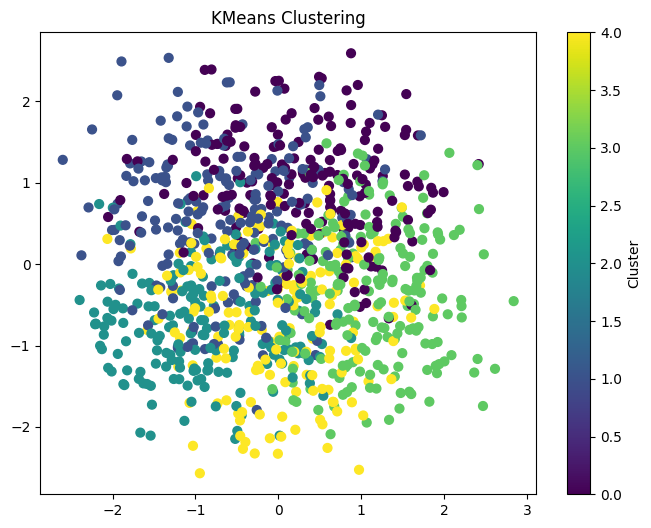
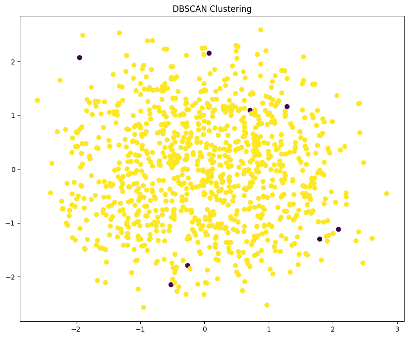
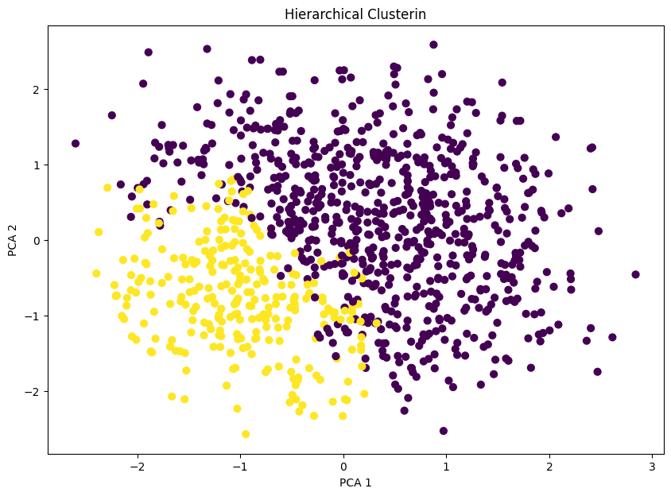

# 🧩 Clustering Student Synthetic Data
🌀 Clustering App with Gradio
Link:https://huggingface.co/spaces/Sanjaysk17/clustering_

An interactive Clustering Web Application built using Python, Scikit-learn, Plotly, and Gradio.

This app allows users to:

Upload their own dataset (CSV)

Choose a clustering algorithm (KMeans, DBSCAN, Agglomerative)

Optionally upload a pretrained .pkl model

Visualize clusters in 2D/3D interactive plots

Download clustered results as CSV

🚀 Features

✅ Upload any CSV dataset
✅ Upload or use pre-trained .pkl clustering models
✅ Choose clustering algorithm from dropdown
✅ Real-time interactive 2D/3D plots with Plotly
✅ Automatic preprocessing (numeric columns + scaling)
✅ Clustered results downloadable as CSV

🛠️ Libraries Used

numpy, pandas → Data handling

matplotlib, seaborn, plotly → Visualization

scikit-learn → Clustering algorithms

scipy → Hierarchical clustering & dendrogram

gradio → Web interface
This project demonstrates **unsupervised machine learning** techniques to cluster student data into meaningful groups.  
We compare **K-Means**, **DBSCAN**, and **Hierarchical Clustering** using the dataset `data_student_synthetic.csv`.  

---

## 📂 Files
- **`task.ipynb`** → Jupyter notebook with implementation.  
- **`data_student_synthetic.csv`** → Synthetic dataset used for clustering.  

---

## ⚡ Algorithms Used

### 1️⃣ K-Means Clustering
- Groups data into **K clusters** by minimizing **intra-cluster variance (WCSS)**.  
- Best **K** chosen using the **Elbow Method** & **Silhouette Score**.  

📸 Example result:  


---

### 2️⃣ DBSCAN (Density-Based Spatial Clustering of Applications with Noise)
- Groups points based on **density**.  
- Identifies **noise points** (outliers).  
- Does not require specifying number of clusters.  

📸 Example result:  


---

### 3️⃣ Hierarchical Clustering
- Builds a **dendrogram (tree of clusters)**.  
- Clusters formed by cutting the tree at a chosen distance.  
- Useful when the number of clusters is unknown.  

📸 Example result:  


---

## 🛠️ Libraries Used
- `numpy`, `pandas` → Data handling  
- `matplotlib`, `seaborn` → Visualization  
- `scikit-learn` → Clustering algorithms  
- `scipy` → Hierarchical clustering & dendrogram  

---

## 🚀 How to Run
```bash
# Clone this repository
git clone <your-repo-link>

# Install dependencies
pip install -r requirements.txt

# Open the notebook
jupyter notebook task.ipynb
